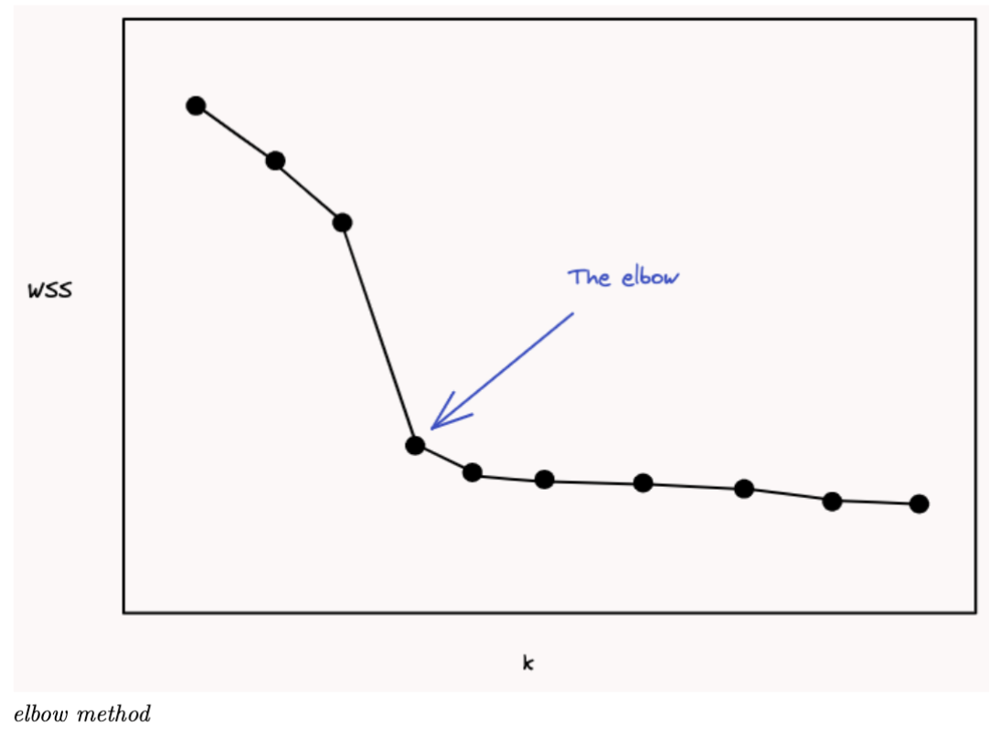

# Unsupervised Learning

The difference between supervised learning and unsupervised learning is that with unsupervised learning there is no Y value, no target, no labels. All we have is X, our feature data, and we want to use those features to explore our data, find useful insights, or solve some specific problems, such as:

• reducing dimensionality

• clustering our observations

• build recommender systems

• anomaly detection

## *1.1 Reducing Dimensionality*

## *1.2 Clustering*

We may want to take our observations and cluster them into homogeneous, non-overlapping groups. By clustering the data into groups (clusters) we may be able to identify what makes certain observations alike and different. Clustering can be useful for doing something like market segmentation, where we might then use these clusters to make more targeted business decisions, or to make models targeted to specific segments. It’s also useful for clustering documents, galaxies, proteins, etc..

With clustering algorithms we will be looking at distances between observations using thefeatures, usually some type of Euclidean distance. Often we want to first normalize our features so that all features are on the same scale and no feature will dominate the distance measurement.For our distance, we just have to make sure we follow these rules:

• the distance is always non-negative

• distance between points A and B is 0 only if A = B

• symmetry: dist(A,B) = dist(B,A)

• triangle inequality: dist(A,B) + dist(B,C)≥dist(A,C)2

### 1.2.1 K-means

k-means is the most well-known **clustering** algorithm and works by **grouping your data into k clusters** that are separated by straight lines. **Essentially you want to find k non-overlapping clusters C** such that some measure of the inertia is minimized - usually we’ll use the within clusters sum-of-squares:

where C is a cluster, and is the cluster centroid. **Note that the cluster centroid is not necessarily a point in X.** Typically, the distance function that we use, that we want to minimize, is the Euclidean distance (in sklearn) but could also be the Manhattan distance (the L1 norm rather than L2 norm), which is the same as k-medians instead of k-means.

How to choose K?
**Elbow Method**

1. Try different values of K
2. Calculate the WCSS(within-cluster-sum-of-square)
3. Choose the K that reduce WCSS the most

#### **K-means 運作的流程步驟：**

1. 首先設定要分成多少群：K
2. 然後在特徵空間中隨機設定K個群心。(centroid不一定要是data point)
3. 計算每一個資料點到K個群心的距離 ( 基本上使用 L2距離，但也是可以換成別的。在sklearn 是L1距離)
4. 將資料點分給距離最近的那個群心。
5. 在所有資料點都分配完畢後，每一群再用剛剛分配到的資料點算平均(means)來更新群心。
6. 最後不斷重複3–5 的動作，直到收斂 ( 每次更新後群心都已經不太會變動 ) 後結束。

K-means 演算法的時間複雜度為 O(NKT) ， 其中：N 為資料的數量， K 為群集數量， T 是重複次數。K-means works well with conver

缺點：

1. K-means often does not produce the perfect because it start from not perfect start points.
2. Clustering result is very sensitive to the starting points.

方法: 

1. To solve this issue we can repeat the process step 1-6 and calculate the total variation and choose the lowest one.

#### 面試題目:

Q: How is K-means clustering different from hierarchial clustering?
A: K-means tries to put all the data into K clusters that you tell it to.
Hierarchial clustering just tell you what the two most simarliar data. 

Q: What if our data isn't in only one diemension?
A: Pick the random K points in the beginning, and use the Euclidean distance. And then assign point to the nearest cluster. 

Q: What if my data is a heatmap?
A: If we just have two cols, we can rename them as X and Y and calculate the distance in the coordinate system. 

$$
\sqrt{a^2+b^2+c^2+d^2+...}
$$

$$

$$
