# Machine Learning Implementation from scratch

Using libraries like Sklearn make it easy to create machine learning models, but they can also hinder learning by hiding the inner workings of the models. To gain a deeper understanding of how these models function, it's important to build them from scratch. That's what this repository aims to do by explaining the concepts behind various models, both supervised and unsupervised, and providing code implementations using clear and easy-to-understand language.In this repo, I will show the theory of different models, including supervised learning and unsupervised learning, and implement these models from scratch.

## Supervised Learning Algorithm

Supervised learning is a type of machine learning which the algorithm learns from labeled data, helps you to predict outcomes for unforeseen data. The goal is for the algorithm to learn the relationship between the input data and the labeled output data, so that it can accurately predict the output for new, unseen input data. Examples of supervised learning include classification problems, such as image recognition, and regression problems, such as predicting housing prices.It means some data is already tagged with the correct answer and seems like in the presence of a supervisor or a teache

## Regularization

Motivation for [regularization]():

1. Model with too many parameters will overly complex and might overfit
2. Outliers can skew line and cause bad generalization
3. Data with too many features can get extreme coefficients

> *Regularization, in whatever form you use it, is mainly about **reducing complexity and overfitting** so that your model generalizes well to new unseen data! *

Extreme coefficients are unlikely to yield good model generalization, so what we can do is simply constrain the size of the model coefficients.

---

### L1 (Lasso) Regularization

L1 regularization adds the sum of the absolute value of the coefficient to loss function which help reduce model complexity and improve generality. The L1 regularized coefficients located on the diamond-shaped zone has below pros:

1. L1 regularization allows superfluous coefficients to shrink directly to zero

   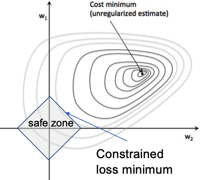
2. L1 regularization can reduce the number of features and select features

   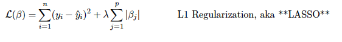

```python
class LinearRegression:  # NO MODIFICATION NECESSARY
    def __init__(self,
                 eta=0.00001, lmbda=0.0,
                 max_iter=1000):
        self.eta = eta
        self.lmbda = lmbda
        self.max_iter = max_iter

    def predict(self, X):
        n = X.shape[0]
        B0 = np.ones(shape=(n, 1))
        X = np.hstack([B0, X])
        return np.dot(X, self.B)

    def fit(self, X, y):
        self.B = minimize(X, y,
                          loss_gradient,
                          self.eta,
                          self.lmbda,
                          self.max_iter)

```

### L2 (Ridge) Regularization

L2 regularization adds the sum of the square of the parameters into the loss function which also help reduce model complexity and improve generality. The L2 regularized coefficients located on the circle-shaped zone has below pros:

1. L2 regularization tends to shrink coefficients evenly

   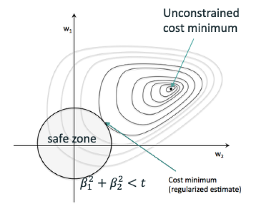
2. L2 regularization useful when you have collinear/codependent features since L2 regularization will reduce the variance of these coefficient estimates

   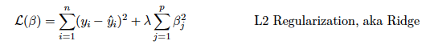

```python
class RidgeRegression:  
    def __init__(self,
                 eta=0.00001, lmbda=0.0, addB0=False,
                 max_iter=1000):
        self.eta = eta
        self.lmbda = lmbda
        self.max_iter = max_iter
        self.addB0 = False

    def predict(self, X):
        n = X.shape[0]
        B0 = np.ones(shape=(n, 1))
        X = np.hstack([B0, X])
        return np.dot(X, self.B)

    def fit(self, X, y):
        B0 = np.mean(y)
        self.B = minimize(X, y, loss_gradient_ridge,
                          self.eta, self.lmbda,
                          self.max_iter, addB0=False,
                          precision=1e-9)
        self.B = np.vstack([B0, self.B])

```

### Elastic Net Regularization

You may be wondering if you can combine both L1 and L2 penalties into a single model. The answer is yes, and it is called Elastic Net. But it not common to use.

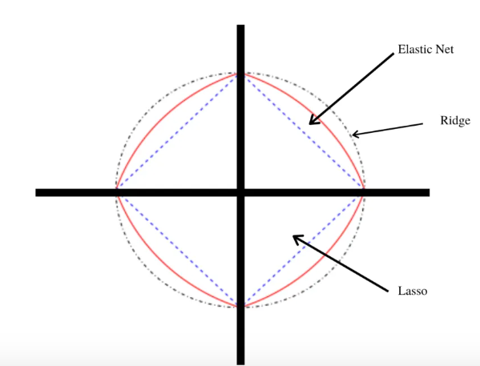

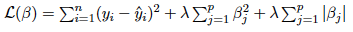

#### Key Conclusion for Regularization

1. Regularization adds a little bit of bias to the model in order to reduce variance, i.e. increase generality by restricting the size of the 𝛽
2. Hard constraint: min-loss is inside safe zone or on zone border
3. Soft constraint: penalty discourages bigger parameters
4. L1(Lasso) shrinks coefficients to 0, so it can be used for feature selection
   L2(Ridge) shrinks coefficients towards each other and towards 0, but not to 0
5. With correlated features, L1 will pick one at random, L2 reduces the variance of β**i which reduces impact of collinearity
6. L1 linear regression and L1/L2 logistic regression require iterative solution

---

## Gradient Descent 

What options do we have for finding β that minimizes L?

• we could do a grid search over a large grid of parameter values (only for models that have a very small number of parameters)

• choose randomly?

• Newton’s method?

#### Slope(gradient) & Learning rate(η)

To determine which direction to adjust β, we use the slope (gradient) of the loss function at the current value of β. The gradient, specifically the sign of the gradient, tells us which direction we need to move in order to keep going **downhill** towards a minimum.

And the gradient is the derivative and the sigh of derivative tell us the direction: if > 0, go negative; if < 0, go positive; if = 0, stop

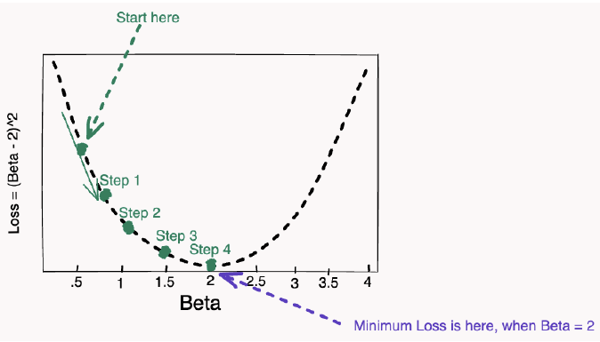


If the slope is negative, then we want to move to the right, because that would mean we are moving downhill. If the slope is positive, we want to move to the left so that we don’t keep going uphill. So, we want to move in the direction of the negative derivative. Note also that the derivative has a magnitude which tells us how steep the slope is in that direction. We can use that information to tell us how big of a step we should take (how much to adjust β). 

We want to be able to control our steps, so we will apply what’s called a learning rate (η) which lets us control our step size. Using η and the slope (derivative), the algorithm is: 

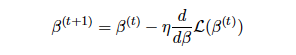 *where t indicates which step we are on.*

However, if the learning rate is to big, the step size will too large and bounce back and forth.

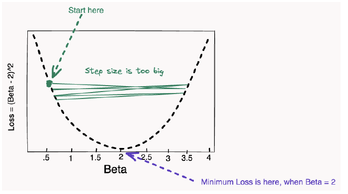

pseudocode:

> b = random value
> while not_converged:
> b = b - rate * gradient(b)

```python
# Define your loss function and gradient function
def f(b): return (b-2)**2
def gradient(b): return 2*(b-2)
# pick a random value of b to start
# choose a learning rate
b = np.random.uniform(0,4)
rate = 0.2
# loop
for t in range(10):
b = b - rate * gradient(b)
```

#### Momentum

Add a fraction of previous step to current step in order to reinforce movement in the same direction as previous step. 

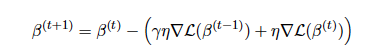

Here, γ is a hyperparameter that controls the momentum that we add.

#### Adagrad

Adapt learning rate η to each of parameters β, so that taking different steps in each direction. A single learning rate might have us bounce back and forth or move too slowly down the shallow slope. 

Each parameter's learning rate η is dividing by the square root of the sum of the squared historical gradients, i.e. we save the history of the gradients, square these, sum them, and take the square root.

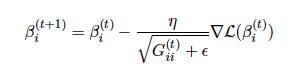

*ϵ is just a smoothing paramater to keep from dividing by zero, and can be set very small.*

## Naïve Bayes

[Naïve Bayes](https://github.com/ajinChen/machine-learning-from-scratch/blob/main/Na%C3%AFveBayes/bayes.py) model is based on the Bayes' theorem under the naïve assumption: conditional independence. In this assumption, we don't consider the order of the words (if we don't use this assumption, we need to consider all combinations (relation) for n words, which grow exponentially with length n)


#### Estimate P(w|c)

We need to avoid `P(w|c) = 0` in below cases since it will lead to entire product goes to zero:

1. w never use in docs of class c
2. Dealing with unknown or misspelled words
3. Likelihood of any unknown / never used word is small: `1 / (wordcount(c) + |V| + 1)`
   in which `|V|` is the number of uni-word in train data

 


```python
class NaiveBayes:
    """
    This object behaves like a sklearn model with fit(X,y) and predict(X) functions.
    Limited to two classes, 0 and 1 in the y target.
    """
    def __init__(self, pwc1=None, pwc0=None, p_c=None):
        self.pwc1 = pwc1
        self.pwc0 = pwc0
        self.p_c = p_c

    def fit(self, X:np.ndarray, y:np.ndarray) -> None:
        ...
        # p(w,c)
        vocab_num = len(X[0]) - 1
        y_0 = (y - 1) * -1
        wc_wc1, wc_wc0 = np.dot(y.reshape(1, -1), X) + 1, np.dot(y_0.reshape(1, -1), X) + 1
        wc_c1, wc_c0 = np.sum(wc_wc1) + vocab_num + 1, np.sum(wc_wc0) + vocab_num + 1
        p_wc1, p_wc0 = wc_wc1 / wc_c1, wc_wc0 / wc_c0
        self.pwc1, self.pwc0 = p_wc1, p_wc0
				...
```

#### Estimate P(c|d)

We need to avoid floating point underflow, so need to use `log` to change product becomes summation.


- `P(c)` is ratio of docs in *c* to overall number of docs
- `P(w|c)` is ratio of word count of *w* in *c* to total word count in *c*

```python
class NaiveBayes:
    """
    This object behaves like a sklearn model with fit(X,y) and predict(X) functions.
    Limited to two classes, 0 and 1 in the y target.
    """
    ...
    def predict(self, X:np.ndarray) -> np.ndarray:
        log_pwc1 = np.log(self.pwc1).reshape(-1, 1)
        pro_1 = np.dot(X, log_pwc1) + np.log(self.p_c[1])
        log_pwc0 = np.log(self.pwc0).reshape(-1, 1)
        pro_0 = np.dot(X, log_pwc0) + np.log(self.p_c[0])
        pred = []
        for i in range(len(pro_1)):
            if pro_1[i] >= pro_0[i]:
                pred.append(1)
            else:
                pred.append(0)
        return np.array(pred)
```

## Adaboost

[AdaBoost](https://github.com/ajinChen/machine-learning-from-scratch/blob/main/Adaboost/adaboost.py) also called adaptive boosting is a technique in machine learning used as an ensemble method which improving the prediction power by converting a number of weak learners to strong learners. The most common algorithm used with AdaBoost is decision stumps which means decision trees with only 1 split.`<br>`

The principle behind boosting algorithms is first we built a model on the training dataset, then a second model is built to rectify the errors present in the first model. This procedure is continued until and unless the errors are minimized, and the dataset is predicted correctly.


The procedure of adaboost and partial code are showed below:


```python
def adaboost(X, y, num_iter, max_depth=1):
    """
    Given an numpy matrix X, a array y and num_iter return trees and weights
    Input: X, y, num_iter
    Outputs: array of trees from DecisionTreeClassifier, trees_weights array of floats
    """
    trees, trees_weights = [], []
    N, _ = X.shape
    w = np.ones(N) / N
    delta = 0.0001
    for i in range(num_iter):
        tree = DecisionTreeClassifier(max_depth=max_depth, random_state=0)
        tree.fit(X, y, sample_weight=w)
        y_hat = tree.predict(X)
        mask = [int(x) if int(x) == 1 else 0 for x in (y_hat != y)]
        error = np.dot(w, (y_hat != y)) / np.sum(w)
        alpha = np.log((1-error) / (error+delta))
        w = np.multiply(w, np.exp([x * alpha for x in mask]))
        trees.append(tree)
        trees_weights.append(alpha)
    return trees, trees_weights
```

## Gradient Boosting

[Gradient boosting](https://github.com/ajinChen/machine-learning-from-scratch/blob/main/GradientBoosting/gradient_boosting.py) is an advanced model standing out for its prediction speed and accuracy, particularly with large and complex datasets by helping us minimize bias error (residual) of the additive models.

The main idea behind the Gradient Boosting is to build models gradually & sequentially and these subsequent models try to reduce the errors of the previous model. The only difference between the design of Regressor and classifier is the Loss function, like `MSE` for regression and `log-loss` for classification. The objective here is to minimize this loss function by adding weak learners using gradient descent.


The procedure of gradient boosting and partial code are showed below:


```python
def gradient_boosting(X, y, num_iter, max_depth=1, nu=0.1):
    """
    Given X, a array y and num_iter return y_mean and trees
    Input: X, y, num_iter
           max_depth
           nu: shinkage
    Outputs: y_mean, array of trees from DecisionTreeRegression
    """
    trees = []
    N, _ = X.shape
    y_mean = np.mean(y)
    fm = y_mean * np.ones(N)
    for i in range(num_iter):
        rm = y - fm
        tree = DecisionTreeRegressor(max_depth=max_depth, random_state=0)
        tree.fit(X, rm)
        fm += nu * tree.predict(X)
        trees.append(tree)
    return y_mean, trees  
```

## Matrix Factorization

Matrix Factorization is a class of collaborative filter algorithm used in recommender system by using categorical embedding method to create users embedding & item embedding and predict how likely users will buy a specific item.


```python
class MF(nn.Module):
    def __init__(self, num_users, num_items, emb_size=100, seed=23):
        super().__init__()
        torch.manual_seed(seed)
        self.user_emb = nn.Embedding(num_users, emb_size)
        self.user_bias = nn.Embedding(num_users, 1)
        self.item_emb = nn.Embedding(num_items, emb_size)
        self.item_bias = nn.Embedding(num_items, 1)
        self.user_emb.weight.data.uniform_(0,0.05)
        self.item_emb.weight.data.uniform_(0,0.05)
        self.user_bias.weight.data.uniform_(-0.01,0.01)
        self.item_bias.weight.data.uniform_(-0.01,0.01)

    def forward(self, u, v):
        U = self.user_emb(u)
        V = self.item_emb(v)
        b_u = self.user_bias(u).squeeze()
        b_v = self.item_bias(v).squeeze()
        return torch.sigmoid((U*V).sum(1) +  b_u  + b_v)
```

In this repo, I implement the MF algorithm system by PyTorch and NumPy.

In [NumPy MF model](https://github.com/ajinChen/machine-learning-from-scratch/blob/main/MatrixFactorization/mf.py), we can calculate the gradient by using SciPy sparse matrix which can speed up calculation since we don't need to persistent the whole utility matrix in computer memory. After we complete the training process and get the embedding for users and items, we can recommend items to user based on prediction.

In [PyTorch MF model](https://github.com/ajinChen/machine-learning-from-scratch/blob/main/MatrixFactorization/mf.py), we firstly initialize user embedding and item embedding by calling `nn.Embedding()`. And choose the loss function ( `MSE` for regression and `log-loss` for classification) and calling `.backward()` to calculate the gradient through backpropagation and use `.step()` to update the parameter.


## Decision Tree

Decision Tree is a tree-based algorithm which find split point giving least MSE (least residual variance) or least gini impurity (high purity) and partitions feature space into rectangular hypervolumes predicting average / most common y in volume.

#### Design Decision Tree Structure:

`Internal tree node class`: perform feature comparisons and split

```python
class DecisionNode:
    def __init__(self, col, split, lchild, rchild):
        self.col = col
        self.split = split
        self.lchild = lchild
        self.rchild = rchild

    def predict(self, x_test):
        if x_test[self.col] <= self.split:
            return self.lchild.predict(x_test)
        else:
            return self.rchild.predict(x_test)
```

`Leaf node class`: make prediction for rectangular hypervolumes

```python
class LeafNode:
    def __init__(self, y=None, prediction=None):
        self.prediction = prediction

    def predict(self, x_test):
        return self.prediction
```

After node class implementation, we need to define general decision tree class to realize `fit`, `best_split_func`, and `predict` for [RegressionTree &amp; ClassifierTree class](https://github.com/ajinChen/machine-learning-from-scratch/blob/main/DecisionTree/dtree.py)

#### Hyperparameters:

`Max_depth`: Restricts how many splits tree can make preventing tree from getting too specific to training set

`min_samples_leaf`: tree don’t split regions less than min_samples_leaf records

| Pros                                                                      | Cons                                       |
| ------------------------------------------------------------------------- | ------------------------------------------ |
| Avoid inefficiency and the distance metric requirement of kNN             | Easy to overfitting and killing generality |
| No need to normalize data                                                 |                                            |
| partition (nominal/ordinal) categorical variables by subsets as "regions" |                                            |

## Random Forest

[Random forest](https://github.com/ajinChen/machine-learning-from-scratch/blob/main/RandomForest/rf.py) is a advanced algorithm using the collection of decision trees trained on subset of training data (bootstrapping) and sometimes ignoring features, average or majority vote among trees

#### The key of random forest is adding randomness:

1. Random subset of training data `<br>`
   Bagging uses bootstrapping: from 𝑛 records, randomly select 𝑛 with replacement

   ```python
   def bootstrap(X, y, size):
       idx = [i for i in range(size)]
       n = size
       X_boot, idx_sample, y_boot = resample(
           X, idx, y, replace=True, n_samples=int(n))
       idx_oob = list(set(idx) - set(idx_sample))
       return X_boot, y_boot, idx_oob
   ```
2. Random subset of features `<br>`
   `max_features` : Degrade training by forgetting some features exist when making splitting decisions
3. A bag of decision trees `<br>`
   Give many weaker decision trees to make average predict from them

   ```python
   class RandomForest:
       ...
       def fit(self, X, y):
           """
           Given an (X, y) training set, fit all n_estimators trees to different,   
           bootstrapped versions of the training data.
           """
           rf_list = []
           for i in range(self.n_estimators):
               X_boot, y_boot, oob_idxs = bootstrap(X, y, len(X))
               T = self.tree(oob_idxs)
               rf_list.append(T.fit(X_boot, y_boot))
           self.trees = rf_list
       ...
   ```
4. Out-of-bag (OOB) score `<br>`
   Use the out-of-bag data of each decision tree as the validation set.

   ```python
   def compute_oob_score(self, X, y):
       n = len(X)
       oob_counts = np.zeros((n,))
       oob_preds = np.zeros((n,))
       for tree in self.trees:
         for idx in tree.oob_idxs:
             leafsizes = len(tree.leaf(X[idx]).y_value())
             oob_preds[idx] += leafsizes * tree.predict(X[idx])
             oob_counts[idx] += leafsizes
       oob_avg_preds = oob_preds[oob_preds != 0] / oob_counts[oob_counts != 0]
       return r2_score(y[oob_counts != 0], oob_avg_preds)
   ```

| Pros                                            | Cons                               |
| ----------------------------------------------- | ---------------------------------- |
| Increase accuracy without a tendency to overfit | Slow and need a lot of computation |

## Unsupervised Learning Algorithm

Unsupervised learning is a group of learning algorithms that can learn patterns or goals from data without labels. Comparing supervised learning, unsupervised learning can avoid 'human in the loop'. It sounds really exciting that the algorithm has 'intelligence' to learn patterns and value from data without the guidance of human domain knowledge, but unsupervised learning still has some issues should deal with:

1. We don't know if the results of unsupervised learning are meaningful since we have no labels.
2. The performance of unsupervised learning is not good as supervised learning.
3. We need to define an internal evaluation function in the algorithm.

However, we still need unsupervised learning to help us in some situations, especially in some pattern recognition problems. In these problems, we may meet:

1. Labels of data are costly and huge human labor would be needed to make data annotation.
2. Labels of data are rare and hard to get (clinics data).
3. We have no idea of the pattern or relationship of data and need the gist of it.

### Clustering

Clustering is one of the main unsupervised learning problems, which needs a clustering algorithm to discover similar sub_groups within the data. Clustering Algorithms can be classified as blow list:

1. Exclusive Clustering, in which data are grouped exclusively.
2. Overlapping Clustering, in which data are grouped inclusively with membership value.
3. Hierarchical Clustering, which sets whole data as one cluster and divides it into different sub_clusters.
4. Probabilistic Clustering, which groups different data by probabilistic approach.

In this repo, I will introduce exclusive clustering algorithms, including Kmean, Kmean++, and spectral clustering to deal with different clustering problems and apply them to image clustering problems.

## K-Means

[K-means](https://github.com/ajinChen/machine-learning-from-scratch/blob/main/Kmeans/kmeans.py) is one simple but powerful unsupervised learning algorithm to solve the clustering problem. It can group whole data into k clusters depending on the similarity of each data depending on the objective function we give. We can implement the Kmeans algorithm following blow steps:

1. Set k as the number of the cluster we want to algorithm
2. Randomly choose k data as initial centroids of cluster
3. Compute the similarity (Euclidean Distance) of each data to k centroids
4. Assign each data into K clusters depending on the most similar cluster
5. Repeat the above 3,4 steps until the centroids are almost no_changed.

Let's make a visualization of K-means on blob data.

```python
centroids, labels = kmeans(X, 5, centroids=None)
fig, ax = plt.subplots(1, 2, figsize=(16, 6))
fig.subplots_adjust(wspace=0.3)
ax[0].scatter(X[:,0], X[:,1], c=y_b, s=10)
ax[1].scatter(X[:,0], X[:,1], c=labels, s=10)
...
plt.show()
```


#### Drawback of Kmeans

Kmeans algorithm is really sensitive to the initial k centroids, if we randomly choose the k centroids, it may give us a different answer of the k cluster. We need to make this algorithm more stable, so we have K-means++.

## K-Means++

Kmeans++ is a more stable unsupervised algorithm to make k clusters prediction, which discards the way of randomly choosing initial k centroids. In Kmeans++, we choose k initial centroids with low similarity with each other by following the below steps:

1. Randomly choose the first centroid.
2. Compute the max similarity (min_distance) from each data to each centroid.
3. Choose the lowest similarity (max_distance) point from above as the next centroid.
4. Repeat above 2, 3 steps until we choose k centroids.

#### Visualize Kmeans and Kmeans++ initial centroids on the blob data

The original data with different color points represent different clusters of points in data. I adopt this data on K-means++ and K-means with k=5 setting and visualize the initial k centroids as block points on the plots.

```python
centroids_k = kmeans_select_centroids(X, 5)
centroids_kplus = kmeans_plus_select_centroids(X, 5)
fig, ax = plt.subplots(1, 2, figsize=(16, 6))
...
```


We can discover that the first plot on Kmeans doesn't work well in choosing the 5 centroids for each cluster of original data. However, the second plot on K-means++ works much better on choosing the 5 centroids for each cluster of original data.

## Spectral Clustering

Now let's try Kmeans and Kmeans++ on concentric circle data, the performance of these methods is really poor which could not identify the clusters in a no_linear way. It is because the objective function we define in the Kmeans and Kmeans++ is distance-based. We need to choose another method that can help us deal with this no-linear cluster problem.
Spectral Clustering is a better choice to deal with this problem, which uses an affinity matrix and a degree matrix to represent the similarity of data. We can implement spectral clustering below steps:

1. Create a distance matrix and transform it into an affinity matrix A.
2. Compute the degree matrix D and Laplacian matrix L = D - A.
3. Use L to find eigenvalues and eigenvectors.
4. Choose k eigenvectors of largest eigenvalues and cluster the data in k-dim space.

Let's make a visualization of Kmeans, Kmeans++, and Spectral Clustering on concentric circle data.

```python
centroids_k, label_k = kmeans(X, 2, centroids=None)
centroids_kplus, label_kplus = kmeans(X, 2, centroids='kmeans++')
label_sp = kmeans(X, 2, centroids='spectral')
fig, ax = plt.subplots(2, 3, figsize=(16, 10))
...
```


## Image Clustering (Application)

Unsupervised learning like K-means can be implemented on image data, which can help us realize image compression and detect the main component of the image.

First, let's make a try on a grayscale image. Since we care about the grayscale value and want the k dominant clusters of the image, we reshape the image pixel data into one-dim with one graysacle value and send it to the Kmeans++ algorithm. Then I set the k value with [3, 5, 7] different values. Let's see the results!

```python
img = np.array(Image.open(Path).convert('L'))
h, w = img.shape
img = np.reshape(img, (-1,1))
images_gray = []
n_group = [3, 5, 7]
for k in n_group:
    X = img.copy()
    centroids, labels = kmeans(X, k=k, centroids='kmeans++', max_iter=30)
    centroids = centroids.astype(np.uint8)
    X = centroids[labels]
    images_gray.append(X.reshape(h,w))
...
```


Second, I make a further try on RGB image. Since we care about the color vector values and want the k dominant color of the image, we reshape the image pixel data into one-dim with one color vector in RGB format and send it to the Kmeans++ algorithm. Then I set the k value with [8, 16, 32] different values and assign the k color vectors back to the image. Let's see the results!

```python
img = np.array(Image.open(Path))
h, w, d = img.shape
img = img.reshape(h * w, d)
images_color = []
n_group = [8, 16, 32]
for k in n_group:
    X = img.copy()
    centroids, labels = kmeans(X, k=k, centroids=None, max_iter=30)
    centroids = centroids.astype(np.uint8)
    X = centroids[labels]
    images_color.append(X.reshape(h,w,d))
...
```


# ML

* ML work on structured data(tree base)
  * Random forest
  * Gradient boosted models
  * Naive Bayes
  * Nearest neighbor
  * Support vector machine
  * K-mean(K-mean++)
  * ... more
* DL work on unstructured data(image/voice)
  * Neural networks
  * Fully connected neural network
  * Convolutional neural network
  * Recurrent neural network
  * Transforme

`b = random value while not_converged: b = b - rate * gradient(b) `

```

```
