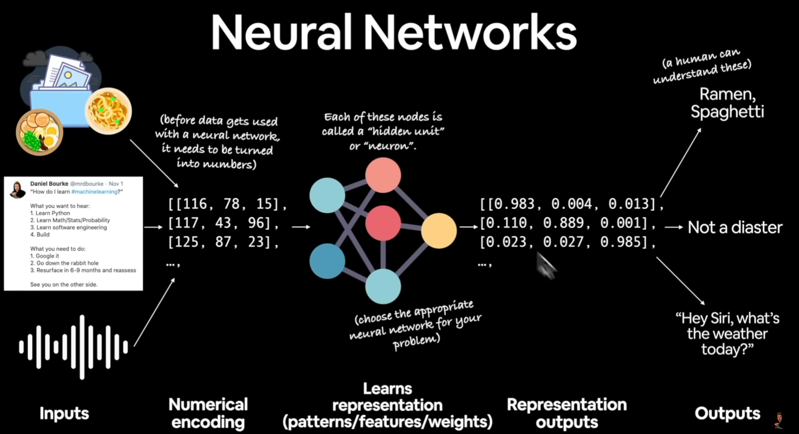
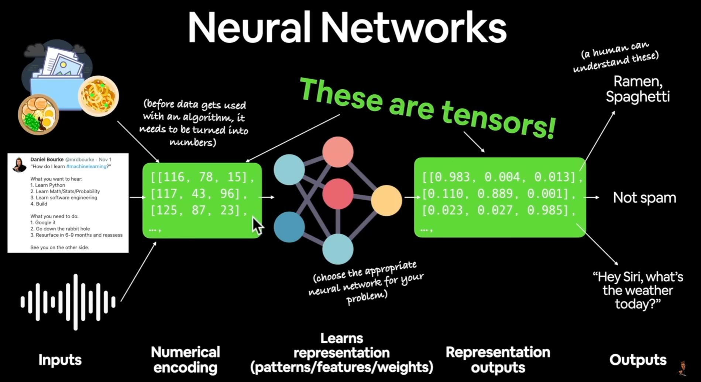
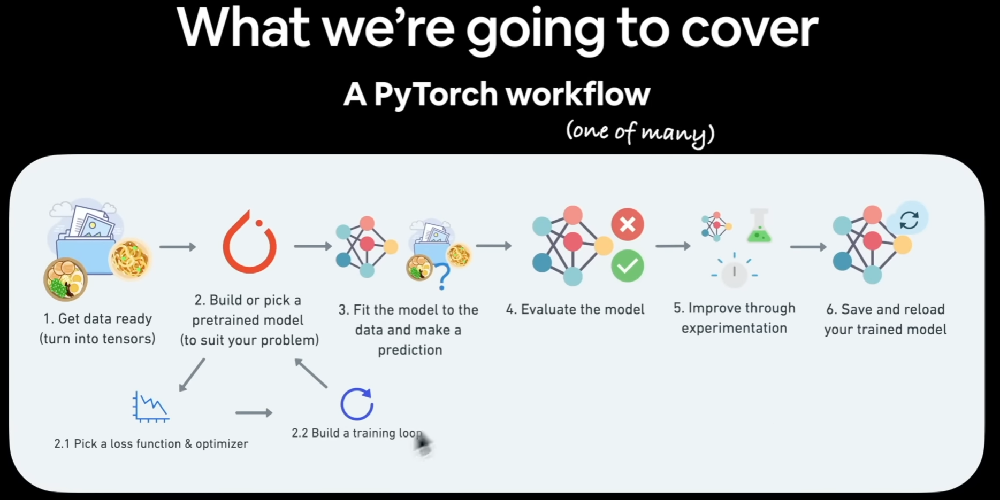

# Deep Learning

#### Why deep learning ?

1. Problems with long list of rules.
   When tradition approach fails, ml/dl may help
2. Continually changing environments
   Dl can adapt(learn) to new scenarios
3. Discovering insights within large collections of data
   you might need to find 101 different list of rules for data

#### Why not deep learning?

1. When you need explainability
   the patterns learned by a deep learning model are often uninterpretable by human
2. When the traditional is better option (simple one)
   if you can accomplish what you need with a simple rule-based system
3. When errors are unacceptable
   since the outputs of dl aren't always predictable
4. when you don't have much data
   dl usually require a fairly large amount data to produce great results

#### Deep Learning Use case

1. Recommendation System
2. Translation (sequence to sequence)
3. Speech recognition (sequence to sequence)
4. Computer Vision (classification/regression)
5. Natural Language Processing(NLP) (classification (spam/non spam) /regression)

#### ML vs DL

* ML work on structured data(tree base)
  * Random forest
  * Gradient boosted models
  * Naive Bayes
  * Nearest neighbor
  * Support vector machine
  * ... more
* DL work on unstructured data(image/voice)
  * Neural networks
  * Fully connected neural network
  * Convolutional neural network
  * Recurrent neural network
  * Transformer
  * ... more

# Pytorch

* Most popular dl framework
* run fast dl code in python(able to run on GPU)
  Cuda : 透過GPU強大的功能，使開發人員能夠對於平行運算，加快計算密集型應用的速度。
* able to access many pre-built dl model (Torch Hub/ torchvision.models)
* Whole stack: preprocess data, model data, deploy model in your application/cloud
* FB / Meta/ Tesla/ Microsoft/ OpenAI

# Neural Networks

DL/ML Steps:

1. Input
2. numerical encoding
3. learns representation(patterns/features/weights)
4. representation output(numerical/prediction probabilities..)
5. output(human understandable)

Components of NN :

* Input layer
* Hidden layer(s)
* Output layer

> **Transfer Learning:** a machine learning method where we reuse a pre-trained model as the starting point for a model on a new task.

> **Reinforcement Learning:** a machine learning training method based on rewarding desired behaviors and/or punishing undesired ones.

## Tensor

> A tensor is a container which can house data in N dimensions, along with its linear operations, though there is nuance in what tensors technically are and what we refer to as tensors in practice.

* Scalar (0-Dimension tensor)
  * A single number is what constitutes a scalar. A scalar is a 0-dimensional (0D) tensor. It, thus, has 0 axes, and is of rank 0 (tensor-speak for 'number of axes').
* Vector (1-Dimension tensor)
  * A vector is a single dimension (1D) tensor, which you will more commonly hear referred to in computer science as an array. An vector is made up of a series of numbers, has 1 axis, and is of rank 1.
* Matrix (2-Dimension tensor)
  * A matrix is a tensor of rank 2, meaning that it has 2 axes. You are familiar with these from all sorts of places, notably what you wrangle your datasets into and feed to your Scikit-learn machine learning models :) A matrix is arranged as a grid of numbers (think rows and columns), and is technically a 2 dimension (2D) tensor.
* 3D or higher tensor
  * While, technically, all of the above constructs are valid tensors, colloquially when we speak of tensors we are generally speaking of the generalization of the concept of a matrix to *N* ≥ 3 dimensions. We would, then, normally refer only to tensors of 3 dimensions or more as tensors, in order to avoid confusion (referring to the scalar '42' as a tensor would not be beneficial or lend to clarity, generally speaking).

